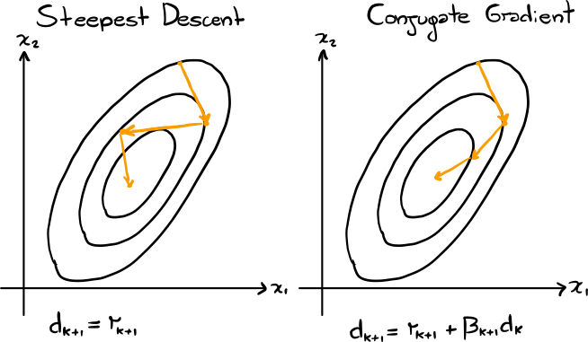

# Numerical Optimization and Stochastic Optimization

## Reports

|||
|:---------------------------------------------------------------------------------:|:---------------------------------------------------------------------------------------:|
| [Unconstrained optimization report](https://github.com/mrandri19/polito-numerical-optimization/blob/main/Relazione_Unconstrained_Optimization.pdf) | [Static stochastic optimization report](https://github.com/mrandri19/polito-numerical-optimization/blob/main/Relazione_Stochastic_Optimization.pdf) |

## Numerical Optimization Laboratories

### Laboratory 1 (Steepest descent and Conjugate gradient for linear systems)
  

### Laboratory 2,3 (Steepest descent for nonlinear functions and application to Lotka-Volterra coefficients estimation)

### Laboratory 4 (Backtracking method for finding steepest descent step)

### Laboratory 5 (Newton Method and backtracking)

### Laboratory 6 (Finite difference gradient, Hessian, and Jacobian)

As well as Netwon method using numerically calculated gradients and Hessians.

### Laboratory 7 (Inexact Newton method)

### Laboratory 8 (Newton method for nonlinear equations)

### Laboratory 9 (Newton method for nonlinear equations with finite differences)

### Laboratory 10 (Steepest Descend and Projected Gradient)

### Laboratory 11 (Constrained Quadratic programming with Schur complement and Null-Space methods)

### Laboratory 12 (Interior Point Method for Linear Programming)

### Laboratory 13 (Interior Point Method for Quadratic Programming)

## Stochastic Optimization Laboratories

### Simulation based approaches
### Stochastic gradient descent and application to predictive maintainance
### Markov Chains and Markov Decision Processes
### Policy Iteration Algorithm and the Bellman's Equation
